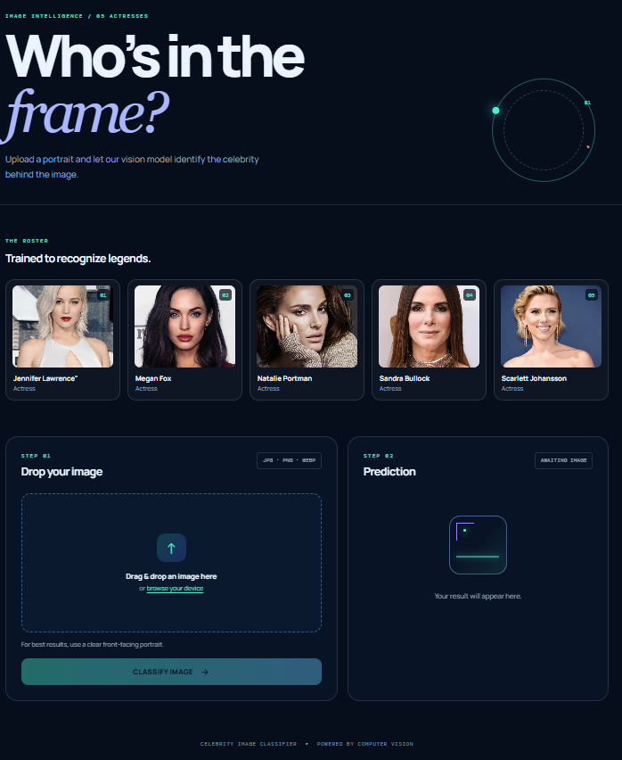

# Celebrity Image Classifier

## Project Screenshot

# Sports Person Classifier

A machine learning web application that identifies a sports person from an uploaded image.

## Recognized Athletes

- Jennifer Lawrence
- Megan Fox
- Natalie Portman
- Sandra Bullock
- Scarlett Johansson

## Features

- Upload or drag and drop an image
- Image preview before classification
- Displays predicted sports person
- Shows probability/confidence scores
- Shows an error message if a face or both eyes cannot be detected
- Responsive modern user interface

## Technologies used in this project,

- Python
- Numpy and OpenCV for data cleaning
- Matplotlib & Seaborn for data visualization
- Sklearn for model building
- Jupyter notebook, visual studio code and pycharm as IDE
- Python flask for http server
- HTML/CSS/Javascript for UI

## How to run

- Start the Python/Flask backend server:

- python server.py

- Confirm that the backend is running at:

http://127.0.0.1:5000

Open app.html in a web browser.

Upload an image and click Classify Image.
